# UFG INF DWM Backend 2018

Repositório utilizado na disciplina *Programação Back-End Avançada* no curso de *[Especialização em Desenvolvimento Web e Mobile - Full Stack](http://inf.ufg.br/espweb-mob) da UFG (Universidade Federal de Goiás) em 2018*.

## Máquina Virtual

Os experimentos necessários para a prática da disciplina poderão ser feitos numa máquina virtual (VM). Essa documentação utiliza uma VM para executar comandos e instruções.

Tal VM possui as seguintes informações:

* Virtualizador: *VirtualBox 5.2.16*
* Sistema operacional: *Ubuntu 18.04.1 64 bits*
* Instalação do SO: Instalado com a opção *Minimal Installation* a partir da imagem *ubuntu-18.04.1-desktop-amd64.iso*.
* Capacidade: 1 CPU, 4GB de RAM e 60GB de armazenamento.
* Host: *mastervm*
* Usuário: *master*
* Senha: *master*

Para seguir as instruções e comandos dessa documentação, é importante saber o básico de Linux. Melhor ainda se souber o básico de Ubuntu. Ao final da disciplina essa VM será entregue aos alunos. Então poderá ser customizada, se necessário, com mais CPU, memória, etc.

Essa é a VM:

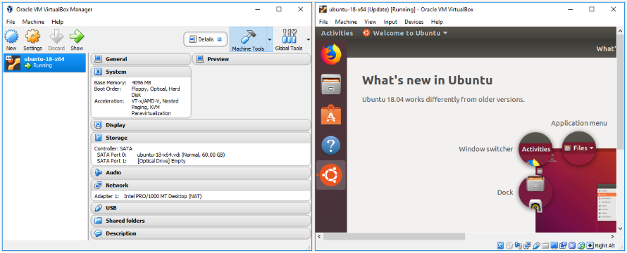

### Terminal

Vários comandos serão executados numa sessão de terminal. Então é importante saber abrir um terminal Linux.

No Ubuntu, o terminal pode ser aberto através do atalho *Ctrl + Alt + T*. Ou então indo ao botão *Apps* da *Dock*, em seguida digitando *terminal* no campo de busca da lista de apps e por fim acionando o ícone *Terminal*. Veja:

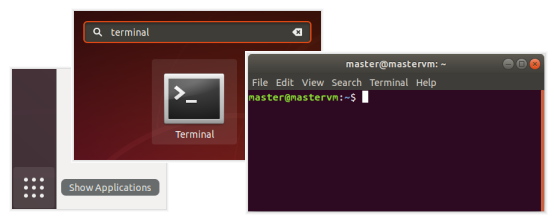

### Atualização de pacotes

Logo após a instalação do Ubuntu na VM e antes de instalar algum pacote, pode ser necessário atualizar a lista de pacotes disponíveis para o sistema operacional. Para isso execute o seguinte comando num terminal:

```sh
sudo apt update
```

Se o comando executar com sucesso, aparecerá algo assim:

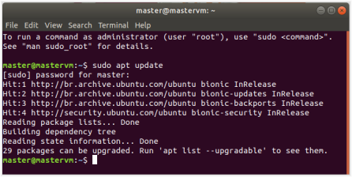

### VirtualBox Guest Additions

Para facilitar a utilização da VM, instalaremos o [*VirtualBox Guest Additions*](https://www.virtualbox.org/manual/ch04.html). Esse pacote facilitará a integração entre a máquina real e a máquina virtual. Entre os recursos que serão instalados com esse pacote, está o compartilhamento de área de transferência (Ctrl + C na máquina real e Ctrl + V na máquina virtual). Usaremos muito esse recurso.

Durante a instalação, o guest additions precisa *construir* os seus *kernel modules*. Eles são necessários para garantir compatibilidade entre a versão do VirtualBox e a versão do Linux. Como a VM está com a instalação mínima do Ubuntu, os pacotes necessários para construir não estão disponíveis. Portanto, antes da instalação do guest additions, precisamos instalar os pacotes *gcc* e *make*.

Para instalar os pacotes gcc e make, execute o comando:

```sh
sudo apt install gcc make
```

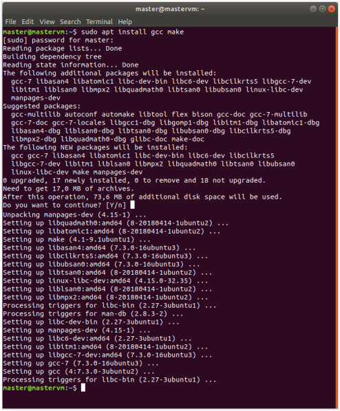

Agora estamos prontos para instalar o VirtualBox Guest Additions.

Certifique-se que a máquina virtual possui um dispositivo de CD. Isso é necessário por que será através dele que acessaremos o pacote de instalação do Guest Additions.

Para isso, no VirtualBox vá ao menu *Machine / Settings... / Storage*. Na lista *Storage Devices* já deve existir um dispositivo de CD com controlador *IDE* ou *SATA*. Se não, crie um. Se o dispositivo estiver presente na VM ele aparecerá também na barra de status.

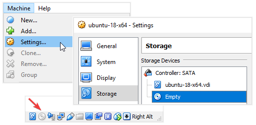

Para associar o dispositivo de CD com o instalador do Guest Additions, com o Ubuntu iniciado, vá ao menu *Devices / Insert Guest Additions CD image...* 

Aguarde um instante e verá um CD montado na área de trabalho e aparecerá também um diálogo com a opção *Run* para executar automaticamente o instalador do Guest Additions.

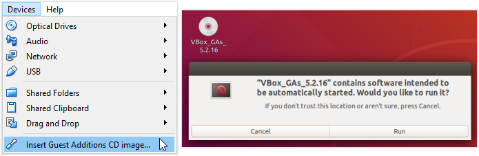

Clique em *Run*, informe a senha do usuário *master* e acompanhe a instalação numa janela de terminal.

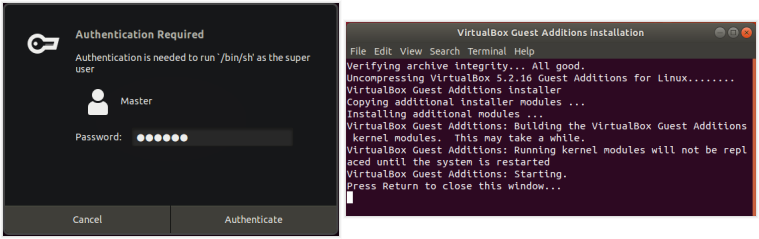

Após a instalação, pressione *Enter* na janela do terminal e reinicie o Ubuntu.

Pronto. Agora você pode habilitar as opções de *Devices / Shared Clipboard* e *Devices / Drag and Drop* para compartilhar a área de transferência e envio de arquivos entre as máquinas reais e virtuais. A área de transferência funciona bem mas o drag and drop apresentou instabilidades.

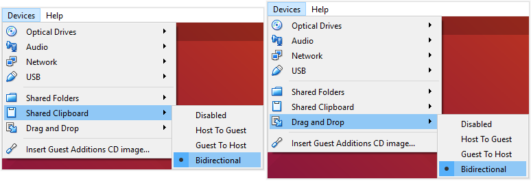

#### Solução de problemas

Se por algum motivo você não conseguiu instalar o Guest Additions através da caixa de diálogo mesmo depois que o CD foi montado, execute o seguinte comando:

```sh
sudo /media/master/VBox_GAs_5.2.16/VBoxLinuxAdditions.run
```

Arquivos enviados à VM via Drag and Drop, ficam no diretório `/tmp/VirtualBox Dropped Files`

Após a instalação, você pode ejetar (desmontar) o CD do Guest Additions ou ainda remover o dispositivo de CD da máquina virtual.

É possível instalar o Guest Additions sem construir os kernel modules, no entanto ele pode não funcionar corretamente. Aparecerá a mensagem *This system is currently not set up to build kernel modules*.

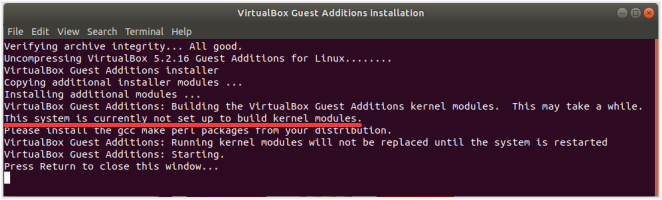

### Customizações

Foram feitas algumas customizações para facilitar a utilização da máquina virtual.

O dispositivo de CD foi removido. Ele foi necessário para o guest additions mas não será mais usado.

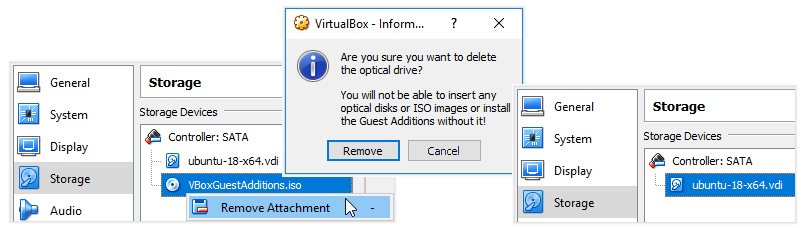

A tela de boas vindas foi preenchida e fechada.

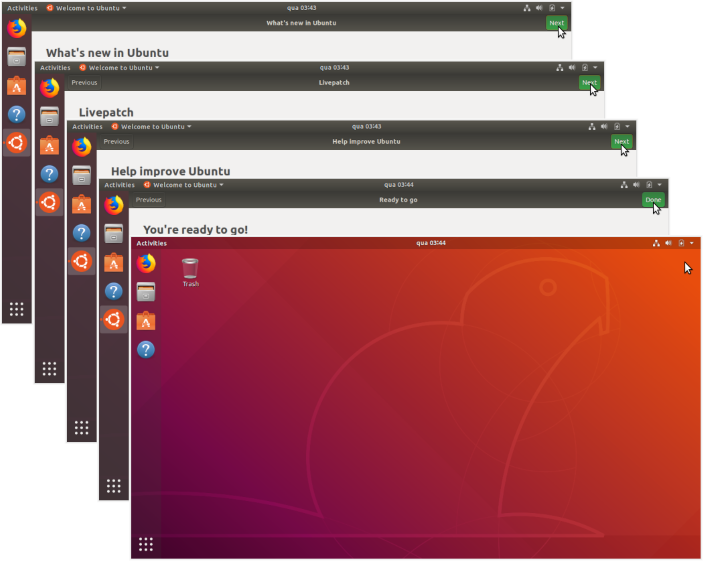

As atualizações automáticas foram desligadas. Isso não deve ser feito numa máquina real!

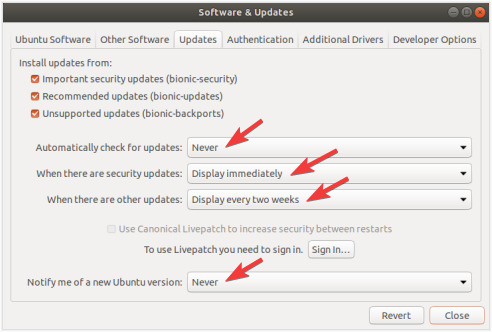

Alguns ícones foram adicionados e removidos da dock panel.

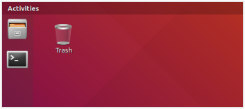

O *Drag and Drop* foi desabilitado. Infelizmente esse recurso está bastante instável.

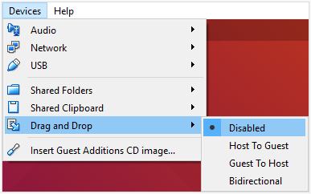

Foi criado um *Shared Folder* para troca de arquivos entre a máquina real e a virtual.

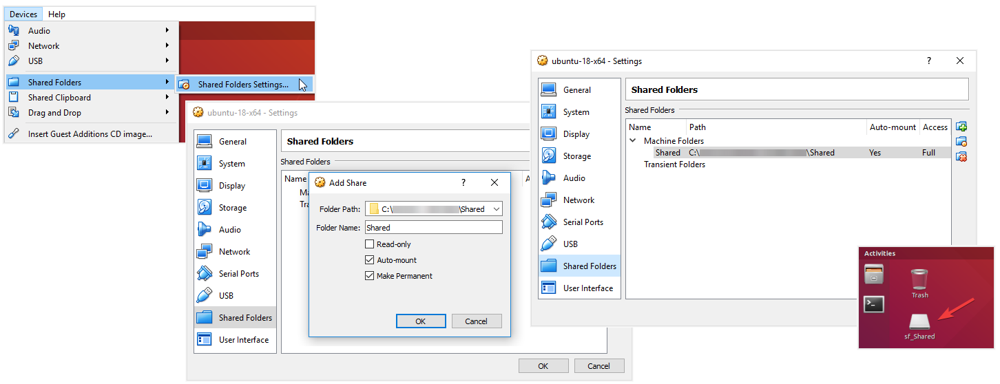

É necessário dar acesso ao usuário *master* ao *shared folder* com o seguinte comando:

```sh
sudo adduser master vboxsf
```

## curl

Instalando:

```sh
sudo apt install curl
```

Verificando:

```sh
curl -V
```

## Chrome

O Ubuntu já vem com o Firefox. No entanto precisaremos do Chrome para algumas tarefas.

Como não usaremos mais o Firefox, vamos removê-lo. Para isso, execute os seguintes comandos:

```sh
sudo apt purge --auto-remove firefox
sudo rm -rf /etc/firefox
sudo rm -rf /usr/lib/firefox
sudo rm -rf /usr/lib/firefox-addons
```


Para instalar o Google Chrome, execute os seguintes comandos:

```sh
wget -O chrome.deb 'https://dl.google.com/linux/direct/google-chrome-stable_current_amd64.deb'
sudo dpkg -i chrome.deb
sudo apt install -f
rm chrome.deb
```

Verificando:

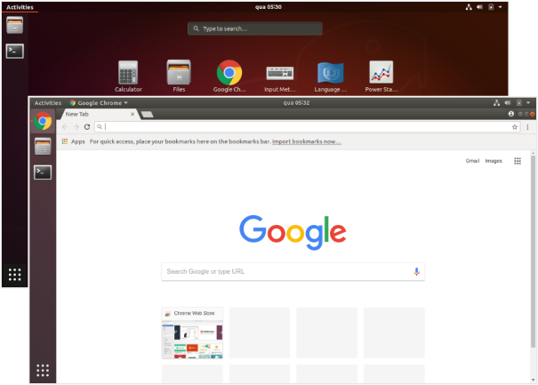

## Git

Utilizaremos o Git para trabalhar no repositório da disciplina.

Para instalar o Git, execute os seguintes comandos:

```sh
sudo apt install git
```

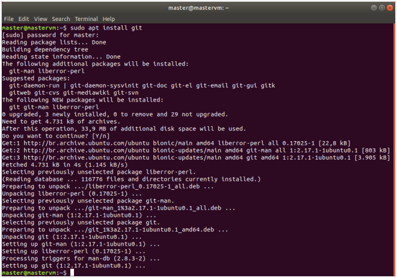

Verificando:

```sh
git --version
```

## Obtendo o repositório

Para começar, você precisa obter o repositório da disciplina.

O endereço do repositório Git dessa disciplina é: https://github.com/walisonmoreira/ufg-inf-dwm-backend-2018

Para obter o repositório é necessário fazer um clone.

```sh
git clone https://github.com/walisonmoreira/ufg-inf-dwm-backend-2018
```

Verificando:

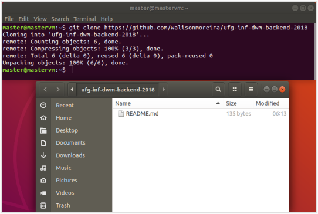

## Visual Studio Code

```sh
wget -O vscode.deb 'http://go.microsoft.com/fwlink/?LinkID=760868'
sudo dpkg -i vscode.deb
sudo apt install -f
rm vscode.deb
```

## NodeJS

### Node

Instalando:

```sh
sudo apt install nodejs
```

Verificando:

```sh
node --version
```

### NPM

Instalando:

```sh
sudo apt install npm
```

Verificando:

```sh
npm --version
```

### Yarn

Configurando repositório e obtendo lista de pacotes:

```sh
curl -sS https://dl.yarnpkg.com/debian/pubkey.gpg | sudo apt-key add -
echo "deb https://dl.yarnpkg.com/debian/ stable main" | sudo tee /etc/apt/sources.list.d/yarn.list
sudo apt update
```

Instalando:

```sh
sudo apt install yarn
```

Verificando:

```sh
yarn --version
```

## Java

### JDK

Instalando:

```sh
sudo apt install openjdk-8-jdk
```

Verificando:

```sh
java -version
```

### Maven

Instalando:

```sh
sudo apt install maven
```

Verificando:

```sh
mvn --version
```

### Gradle

Instalando:

```sh
sudo apt install gradle
```

Verificando:

```sh
gradle --version
```
